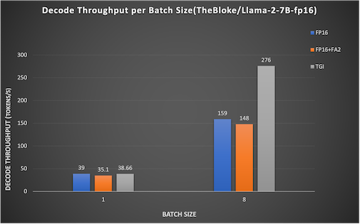

## HF_AMD
Hugging Face libraries natively support AMD GPUs through [PyTorch for ROCm](https://pytorch.org/get-started/locally/) with zero code change.

🤗 Transformers natively supports [Flash Attention 2](https://huggingface.co/docs/transformers/perf_infer_gpu_one#flashattention-2), [GPTQ quantization](https://huggingface.co/docs/transformers/main_classes/quantization#autogptq-integration) with ROCm. [🤗 Text Generation Inference](https://huggingface.co/docs/text-generation-inference/quicktour) library for LLM deployment has native ROCm support, with Flash Attention 2, [Paged Attention](https://huggingface.co/docs/text-generation-inference/conceptual/paged_attention), fused positional encoding & layer norm kernels support.

[Find out more about these integrations in the documentation](https://huggingface.co/docs/optimum/main/en/amd/amdgpu/overview)!

### Prerequisite

* Install [ROCm5.7](https://rocm.docs.amd.com/en/latest/deploy/linux/index.html) to the host machine

* You can follow this repo to test the Hugging Face AMD flows
```bash
git clone https://gitenterprise.xilinx.com/AIG-AIM-ARCH/HF_AMD.git
```

### [**How to use it: Transformers Optimum**](./Transformers)
🤗 [Optimum(Optimum_AMD)](https://huggingface.co/docs/optimum/main/en/amd/index) is an extension of Transformers that provides a set of performance optimization tools to train and run models on targeted hardware with maximum efficiency. Hugging Face libraries supports natively AMD Instinct MI210/MI250 GPUs.

* Setup transformers docker with optimums on ROCm or install locally from source

* Run Application with transformers


### [**How to use it: Text Generation Inference**](./TGI)

🤗 [Text Generation Inference](https://github.com/huggingface/text-generation-inference) library for LLM deployment supports AMD Instinct MI210/MI250 GPUs. 

* LLM server setup: launch model server on the ROCm-enabled docker.

* Client setup: Open another shell and access the server

### [**How to use it: ONNX Runtime with ROCm**](./ORT)

🤗 [Optimum ONNX Runtime](https://huggingface.co/docs/optimum/onnxruntime/usage_guides/amdgpu) integration supports ROCm for AMD GPUs.

* Setup docker ROCm with ort or install `onnxruntime-rocm` package locally from source.

* Run ONNX model by using `ROCMExecutionProvider`:

### Results

Llama2-7B on 1xMI210

Testbench:

```sequence_length```: 512 

```max new tokens```: 1000

```cases```: fp16 model, fp16 + flashattention2, text generation inference

```batch_size```: 1, 8




